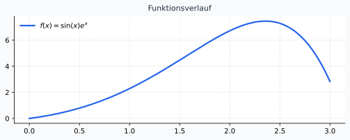
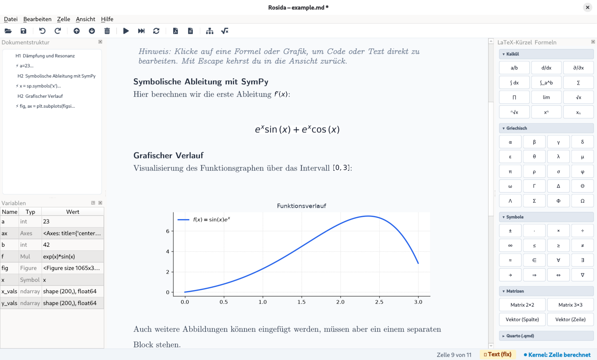

# Dämpfung und Resonanz

```{python}
a=23
b=42
```

Es sei a=23 und b=42. Addiert gibt das 65, niedlich, oder?

Untersuchung der Signalübertragungsfunktion $f(x) = \sin(x) \cdot e^x$.

Das unbestimmte Integral lautet:

$$\int \sin(x) e^x \, dx = \frac{e^x}{2} (\sin(x) - \cos(x)) + C$$

> *Hinweis: Klicke auf eine Formel oder Grafik, um Code oder Text direkt zu bearbeiten. Mit Escape kehrst du in die Ansicht zurück.*

## Symbolische Ableitung mit SymPy

Hier berechnen wir die erste Ableitung $f'(x)$:

```python
x = sp.symbols('x')
f = sp.sin(x) * sp.exp(x)
sp.diff(f, x)
```


$$
e^{x} \sin{\left(x \right)} + e^{x} \cos{\left(x \right)}
$$


## Grafischer Verlauf

Visualisierung des Funktionsgraphen über das Intervall $[0, 3]$:

```python
fig, ax = plt.subplots(figsize=(7.0, 2.8), dpi=100)
x_vals = np.linspace(0, 3, 200)
y_vals = np.sin(x_vals) * np.exp(x_vals)
ax.plot(x_vals, y_vals, color='#2563eb', lw=2.2, label=r'$f(x) = \sin(x) e^x$')
ax.set_title('Funktionsverlauf', fontsize=11, color='#1e293b', pad=8)
ax.set_facecolor('#ffffff')
fig.patch.set_facecolor('#f8fafc')
ax.spines['top'].set_visible(False)
ax.spines['right'].set_visible(False)
ax.grid(True, linestyle=':', alpha=0.6)
ax.legend(frameon=False, loc='upper left')
fig
```


{#fig-1}


Auch weitere Abbildungen können eingefügt werden, müssen aber ein einem separaten Block stehen.

{#fig-screenshot}

::: {.callout-note}
**Pfade anpassen**
Der Pfad ist relativ zum Verzeicnis des aktuelle Dokuments.
:::
