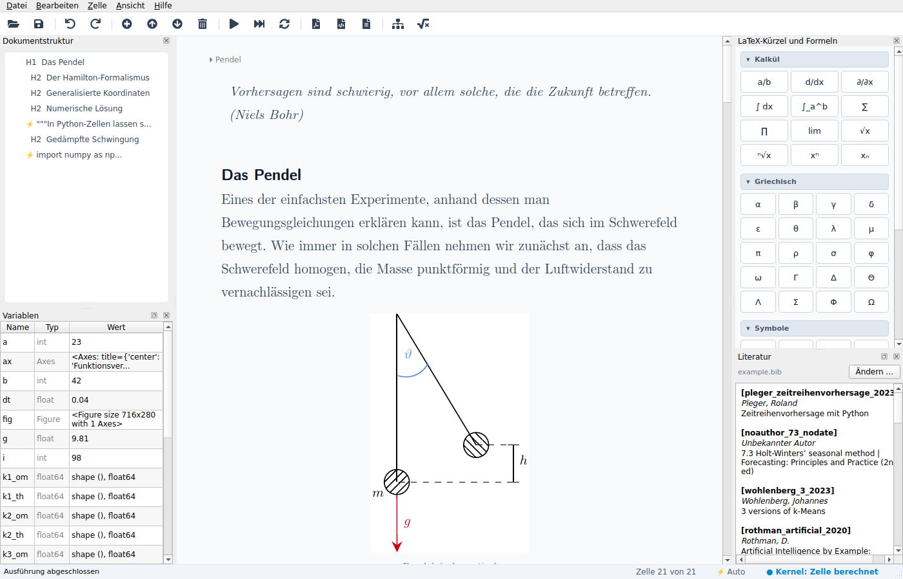
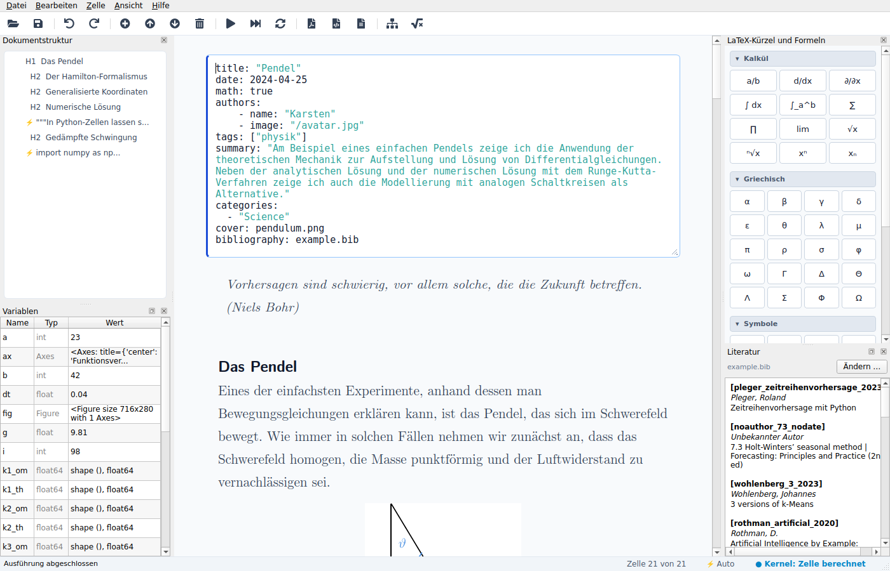
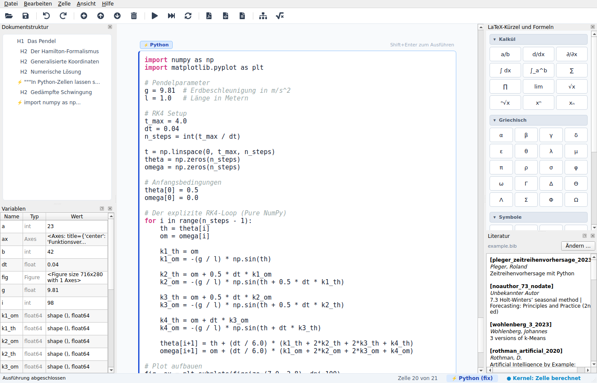
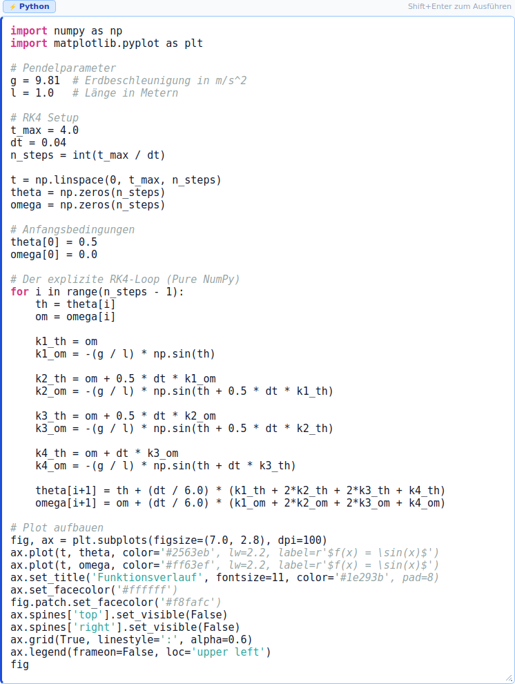
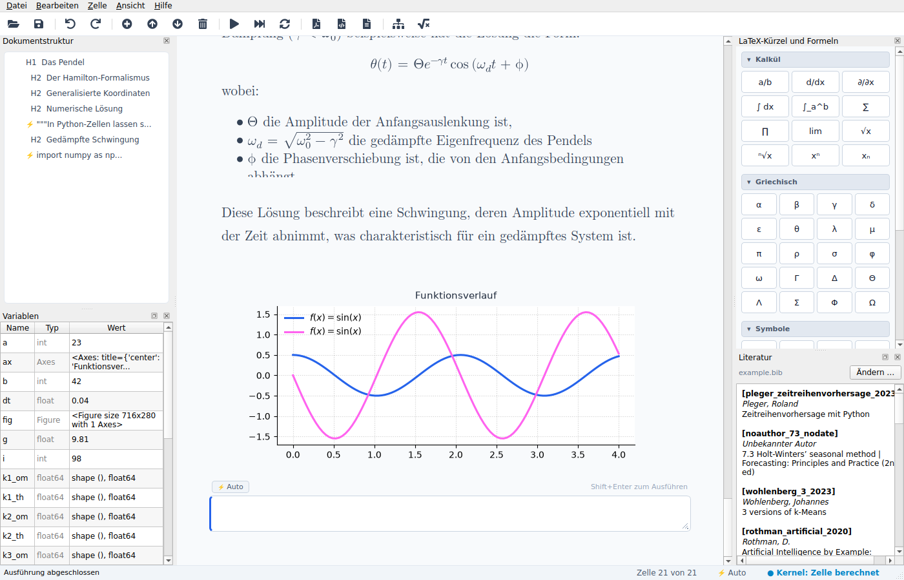
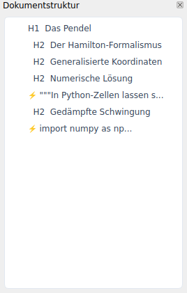
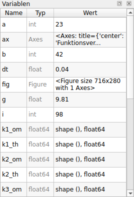
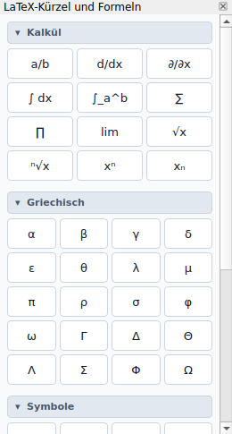
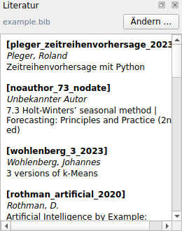

Dieses Handbuch besteht aus zwei Teilen: **Teil I** ist die Kurzanleitung, die Rosida auch über
**Hilfe → Handbuch…** (`F1`) anzeigt. **Teil II** beschreibt die Oberfläche Bereich für Bereich
und geht auf Details ein, die im Schnellstart nur angerissen werden.

Alle Bilder stammen aus dem Beispieldokument `docs/example.md` und werden mit
`just screenshots --out docs/images/screenshots` neu erzeugt (siehe
[Screenshots aktualisieren](#screenshots-aktualisieren)).



# Teil I – Schnellstart

<!-- Quarto bindet die Kurzanleitung hier ein. Ohne Quarto: docs/quickstart.md -->


*Wird an dieser Stelle nur eine Include-Anweisung angezeigt (z. B. auf GitHub), steht die
Kurzanleitung in [quickstart.md](quickstart.md).*

# Teil II – Die Oberfläche im Detail

## Das Hauptfenster


Das Fenster ist in fünf Bereiche gegliedert:

| Bereich | Lage | Inhalt |
|---|---|---|
| Menüleiste und Toolbar | oben | alle Befehle, die häufigsten auch als Symbol |
| Seitenleisten (Docks) links | links | **Dokumentstruktur** und **Variablen** |
| Dokument | Mitte | Dokumenteigenschaften und die Zellen, untereinander |
| Seitenleisten (Docks) rechts | rechts | **LaTeX-Kürzel und Formeln** und **Literatur** |
| Statusleiste | unten | Meldungen, aktuelle Zelle, Modus, Zustand des Kernels |

Die Docks lassen sich verschieben, übereinander stapeln, abdocken und schließen. Rosida merkt
sich Fenstergröße und Anordnung der Docks beim Beenden und stellt sie beim nächsten Start wieder
her. Geschlossene Docks holst du über das Menü **Ansicht** zurück.

### Menüleiste


| Menü | Einträge |
|---|---|
| **Datei** | Neues Dokument, Öffnen…, Zuletzt geöffnet, Speichern, Speichern unter…, Exportieren (PDF, HTML, Quarto), Einstellungen…, Beenden |
| **Bearbeiten** | Rückgängig, Wiederholen, Zelle einfügen, Zelle nach oben / unten verschieben, Zelle löschen, Modus umschalten |
| **Zelle** | Zelle ausführen, Alle ausführen |
| **Ansicht** | Dokumentstruktur, LaTeX-Palette, Variablen, Bibliographie (jeweils ein-/ausblenden) |
| **Hilfe** | Handbuch…, Über Rosida |

Unter macOS erscheinen **Einstellungen…** und **Über Rosida** wie gewohnt im App-Menü „Rosida“.

### Toolbar


Von links nach rechts, in Gruppen:

| Gruppe | Symbole | Kürzel |
|---|---|---|
| Datei | Öffnen, Speichern | `Ctrl+O`, `Ctrl+S` |
| Verlauf | Rückgängig, Wiederholen | `Ctrl+Z`, `Ctrl+Shift+Z` (Windows: `Ctrl+Y`) |
| Zellen | Einfügen (vor der aktiven Zelle), nach oben, nach unten, Löschen | `Ctrl+Shift+A`, `Ctrl+Shift+Up`, `Ctrl+Shift+Down`, `Ctrl+Shift+D` |
| Ausführen | Zelle ausführen, Alle ausführen, Modus umschalten | `Shift+Enter`, `Ctrl+Shift+Return`, `Ctrl+M` |
| Export | PDF, HTML, Quarto | `Ctrl+Shift+P`, `Ctrl+Shift+H`, `Ctrl+Shift+Q` |
| Ansicht | Dokumentstruktur, LaTeX-Palette | `F3`, `F4` |

Unter macOS steht `Ctrl` jeweils für die Befehlstaste `⌘`. Fährst du mit der Maus über ein
Symbol, zeigt ein Tooltip Funktion und Kürzel.

**Speichern** ist nur aktiv, wenn es seit dem letzten Speichern oder Laden tatsächlich
Änderungen gibt. Ein Sternchen im Fenstertitel („Rosida – example.md \*“) zeigt dasselbe an.

### Statusleiste


- **Links** erscheinen kurze Meldungen, etwa „Gespeichert: …“ oder „Ausführung abgeschlossen“.
- **Zelle 20 von 21** nennt die aktive Zelle, also die Zelle, auf die sich Befehle wie
  „Zelle löschen“ oder „Zelle einfügen“ beziehen.
- **Modus-Anzeige**: `⚡ Auto`, `⚡ Python (fix)` oder `📝 Text (fix)` für die aktive Zelle.
- **Kernel**: *Bereit* (grün) vor der ersten Berechnung, *rechnet …* (orange), solange Zellen in
  Arbeit oder in der Warteschlange sind, *Zelle berechnet* (blau) danach.

## Dokumenteigenschaften



Über der ersten Zelle steht eine eingeklappte Zeile mit dem Titel des Dokuments, im Beispiel
„⏵ Pendel“. Ein Klick darauf öffnet den **Eigenschaften-Editor**: den YAML-Kopf der Datei
(„Frontmatter“), wie er auch in Quarto oder Hugo verwendet wird. Mit `Shift+Enter` übernimmst
du die Änderungen, die Zeile klappt wieder ein und zeigt den neuen Titel.

Rosida wertet diese Einträge aus; alle anderen bleiben unverändert erhalten und werden beim
Quarto-Export durchgereicht:

| Eintrag | Wirkung |
|---|---|
| `title`, `subtitle` | Titel in der eingeklappten Zeile und im Kopf des HTML-Exports |
| `authors` (Liste mit `name`) oder `author` | Autorenzeile im HTML-Export |
| `date` | Datum im HTML-Export |
| `summary` | Einleitung unter dem Titel im HTML-Export |
| `lang` | Sprache der Exporte, z. B. `de` oder `en-US` (siehe [Sprache](#sprache-und-einstellungen)) |
| `bibliography` | Literaturdatei(en), relativ zum Dokument (siehe [Literatur](#literatur-und-zitate)) |
| `format` | wird an Quarto durchgereicht; fehlt er, ergänzt der Quarto-Export HTML und Typst |

Beispiel:

```yaml
title: "Pendel"
date: 2024-04-25
lang: de
authors:
  - name: "Karsten"
summary: "Analytische und numerische Lösung der Pendelgleichung."
bibliography: example.bib
```

## Arbeiten mit Zellen

### Der Zelleditor



Ein Klick auf eine Zelle öffnet ihren Editor. Über dem Eingabefeld stehen links die
**Modus-Pille** und rechts der Hinweis „Shift+Enter zum Ausführen“.



- **Modus-Pille**: `⚡ Auto` rät anhand des Inhalts, ob Python oder Text gemeint ist. Ein Klick
  auf die Pille oder `Ctrl+M` schaltet weiter zu `⚡ Python` und `📝 Text`; dann ist der Modus
  fest. Im Beispiel ist die Zelle fest auf Python gestellt.
- **Syntax-Hervorhebung** für Python und Markdown.
- **Mitwachsender Editor**: Das Eingabefeld ist immer so hoch, dass alle Zeilen sichtbar sind;
  es gibt keine Scrollbar im Editor, gescrollt wird nur das Dokument.
- **Größengriff** unten rechts: Ziehen legt eine Mindesthöhe fest, ein Doppelklick setzt sie
  zurück.
- `Shift+Enter` führt die Zelle aus bzw. rendert sie, `Escape` schließt den Editor ohne neue
  Auswertung. Die Scrollposition des Dokuments bleibt dabei erhalten.

### Zellen einfügen, verschieben, löschen

- **Zelle einfügen** (`Ctrl+Shift+A`) setzt eine leere Zelle *vor* die aktive Zelle.
- **Nach oben / unten** (`Ctrl+Shift+Up` / `Ctrl+Shift+Down`) verschiebt die aktive Zelle um eine
  Position; das geht auch, während du in ihr schreibst.
- **Löschen** (`Ctrl+Shift+D`) entfernt die aktive Zelle. Die letzte Zelle eines Dokuments wird
  nur geleert.
- Alles lässt sich mit **Rückgängig** zurücknehmen. Solange ein Editor den Fokus hat, wirkt
  Rückgängig zuerst auf den Text darin, danach auf die Zellen.

Am Dokumentende steht immer eine leere Zelle bereit. Führst du die letzte gefüllte Zelle aus,
legt Rosida automatisch eine neue an.

### Berechnung im Hintergrund

Python-Zellen rechnen in einem eigenen Thread, damit die Oberfläche bedienbar bleibt:

- Dauert eine Berechnung länger als einen Augenblick, zeigt die Zelle ein Lauflicht mit
  **„Wird berechnet …“**. Zellen, die hinter einer anderen warten, zeigen **„Wartet …“**.
- Die Zellen laufen **der Reihe nach**, weil sie einen gemeinsamen Namensraum haben. Textzellen mit
  `{{ … }}`-Ausdrücken warten ebenfalls, bis die Python-Zellen davor fertig sind.
- Während eine Zelle rechnet, ist ihr Editor schreibgeschützt. Wechselst du in dieser Zeit in
  den Editor, bleibst du dort, wenn das Ergebnis eintrifft.
- `print()`-Ausgaben erscheinen über dem Ergebnis. Bei einem Fehler zeigt die Zelle die letzte
  Zeile der Fehlermeldung rot an; der vollständige Traceback steht im Tooltip.
- Eine laufende Berechnung lässt sich nicht abbrechen. Beendest du Rosida währenddessen, wird
  sie hart beendet.

### Ausgaben von Python-Zellen

| Letzter Ausdruck der Zelle | Darstellung |
|---|---|
| SymPy-Ausdruck oder -Matrix | gesetzte Formel |
| Matplotlib-`Figure` | eingebettete Grafik |
| Polars-`DataFrame` | Tabelle mit Suchfeld, sortier- und scrollbar |
| alles andere | Textdarstellung (`str()`) |
| nichts (z. B. nur Zuweisungen) | kleiner „+“-Kreis, der keinen Platz verbraucht |

## Textzellen im Detail

### Formeln

Formeln in `$ … $` (im Text) und `$$ … $$` (abgesetzt) setzt Rosida mit **ziamath** in der Schrift
**Latin Modern Math**, passend zu den CMU-Schriften des Textes. Unterstützt werden auch Matrizen,
`aligned` und `cases`. Im PDF-Export bleiben die Formeln Vektorgrafik.

### Live-Ausdrücke

`{{ ausdruck }}` wird im gemeinsamen Namensraum ausgewertet. SymPy-Ergebnisse werden zur Formel,
alles andere zu Text. Steht der Ausdruck allein auf einer Zeile, entsteht eine abgesetzte Formel.
Fehler erscheinen rot hervorgehoben mit der Fehlermeldung.

### Quarto-Elemente

Rosida versteht die wichtigsten Quarto-Bausteine, zeigt sie aber nur als Vorschau; die endgültige
Gestaltung übernimmt `quarto render`:

- **Callouts** `::: {.callout-note}` … `:::` (auch `tip`, `warning`, `important`, `caution`)
  erscheinen als farbige Kästen mit Titel. Der Titel kommt aus `title="…"` oder einer Überschrift
  in der ersten Zeile.
- **Abbildungen** `{#fig-name}` werden zentriert mit
  Bildunterschrift angezeigt, relative Pfade gelten ab dem Ordner des Dokuments.
- **Querverweise** wie `@fig-name` bleiben in der Vorschau als Text stehen.



Das Bild oben zeigt das Ende des Beispieldokuments: eine Liste mit Formeln, den Plot der
numerischen Lösung und darunter die leere Zelle für den nächsten Schritt.

## Seitenleisten (Docks)

### Dokumentstruktur (`F3`)



Zeigt die Überschriften (`#`, `##`, `###`) der Textzellen als Gliederung, Python-Zellen erscheinen
mit `⚡` und ihrer ersten Zeile. Ein Klick springt zur Zelle und öffnet sie zum Bearbeiten. Die
Gliederung aktualisiert sich bei jeder Änderung.

### Variablen



Listet alle Variablen des gemeinsamen Namensraums mit **Name**, **Typ** und **Wert**, nach jeder
Berechnung aktualisiert. Module, Funktionen, Klassen und Namen mit `_` am Anfang werden
ausgeblendet. Ein **Doppelklick** fügt den Namen an der Cursorposition der aktiven Zelle ein.

### LaTeX-Kürzel und Formeln (`F4`)



Knöpfe für häufige LaTeX-Bausteine, in einklappbaren Abschnitten: **Kalkül** (Bruch, Ableitung,
Integral, Summe, Grenzwert, Wurzel, Hoch/Tief), **Griechisch**, **Symbole**, **Matrizen** und
**Quarto (.qmd)** (Callouts, Fußnote, Abbildungs- und Tabellenanker, Querverweise). Ein Klick
fügt den Code an der Cursorposition der aktiven Zelle ein; der Tooltip zeigt den eingefügten Code.

### Literatur



Zeigt die Einträge der Literaturdatei aus `bibliography:` mit Schlüssel, Autor und Titel. Oben
stehen der Dateiname und **Ändern …** zum Wählen einer anderen Datei. Ein **Doppelklick** fügt
ein Zitat `[@schlüssel]` in die aktive Zelle ein.

Ist keine Literaturdatei angegeben, erscheint der Knopf **Literatur laden (.bib)**. Die gewählte
Datei wird relativ zum Dokument als `bibliography:` in die Eigenschaften geschrieben. Fehlt die
angegebene Datei, nennt ein Hinweis unter dem Knopf ihren Namen.

## Literatur und Zitate

Zitiert wird in Quarto-Schreibweise:

| Im Text | Ergebnis im Export |
|---|---|
| `[@pleger_zeitreihenvorhersage_2023]` | (Pleger 2023) |
| `[vgl. @a, S. 5; @b]` | (vgl. Wohlenberg 2023, S. 5; Gutman et al. 2022) |
| `[-@key]` | (2023) |
| `@key` im Fließtext | Freiknecht und Papp (2018) |
| unbekannter Schlüssel | **?schlüssel** in Rot |

In der Vorschau bleiben Zitate als `[@…]` stehen. **PDF- und HTML-Export** lösen sie auf, verlinken
sie mit dem Eintrag und hängen die zitierten Werke unter **Quellen** an: alphabetisch, mit URL
bzw. DOI als Link und Abrufdatum. Der **Quarto-Export** übernimmt `bibliography:` mit angepasstem
Pfad, sodass Quarto sein eigenes Literaturverzeichnis im gewünschten Zitierstil erzeugt.

Rosida liest BibTeX-Dateien, wie sie Zotero, JabRef oder Citavi exportieren, einschließlich
LaTeX-Umlauten (`{\"u}`) und Monatsmakros (`month = feb`).

## Export

| Format | Kürzel | Eigenschaften |
|---|---|---|
| **PDF** | `Ctrl+Shift+P` | A4, Formeln und Plots als Vektorgrafik, Zitate und Quellen |
| **HTML** | `Ctrl+Shift+H` | eine eigenständige Datei: Formeln mit KaTeX (per CDN), CMU-Schriften, Bilder und Plots (SVG) eingebettet, Syntax-Hervorhebung und Kopier-Knopf an Codeblöcken, Kopf aus den Eigenschaften, Zitate und Quellen |
| **Quarto** | `Ctrl+Shift+Q` | `.qmd` mit den Eigenschaften, ausgewerteten `{{ }}`-Ausdrücken und Ergebnissen der Python-Zellen; Plots als SVG-Dateien daneben |

Exportiert wird der aktuelle Stand. Rechnet der Kernel beim Export noch, fehlen die Ergebnisse
der noch laufenden Zellen.

## Sprache und Einstellungen

Unter **Datei → Einstellungen…** (`Ctrl+,`) wählst du die Sprache der Oberfläche:
**Systemsprache**, **English** oder **Deutsch**. Die Änderung wirkt nach einem Neustart.
„Systemsprache“ nimmt die erste unterstützte Sprache aus den Spracheinstellungen des
Betriebssystems, sonst Englisch.

**Exporte folgen der Sprache des Dokuments**, nicht der Oberfläche: `lang: de` in den
Eigenschaften ergibt „Quellen“, „abgerufen am“ und deutsche Anführungszeichen, auch wenn Rosida
englisch läuft. Ohne `lang` gilt die Sprache der Oberfläche.

## Tastenkürzel

| Aktion | Kürzel |
|---|---|
| Neues Dokument / Öffnen / Speichern | `Ctrl+N` / `Ctrl+O` / `Ctrl+S` |
| Speichern unter | `Ctrl+Shift+S` |
| Zelle ausführen | `Shift+Enter` |
| Alle Zellen ausführen | `Ctrl+Shift+Return` |
| Editor schließen ohne Auswertung | `Escape` |
| Modus umschalten | `Ctrl+M` |
| Zelle einfügen (vor der aktiven) | `Ctrl+Shift+A` |
| Zelle nach oben / unten | `Ctrl+Shift+Up` / `Ctrl+Shift+Down` |
| Zelle löschen | `Ctrl+Shift+D` |
| Rückgängig / Wiederholen | `Ctrl+Z` / `Ctrl+Shift+Z` (Windows: `Ctrl+Y`) |
| Export PDF / HTML / Quarto | `Ctrl+Shift+P` / `Ctrl+Shift+H` / `Ctrl+Shift+Q` |
| Dokumentstruktur / LaTeX-Palette | `F3` / `F4` |
| Einstellungen | `Ctrl+,` |
| Handbuch | `F1` |

## Speicherformat

Dokumente sind gewöhnliche Markdown-Dateien: die Eigenschaften als YAML-Kopf zwischen `---`,
Python-Zellen als ` ```python `-Codeblöcke, Textzellen als Markdown, aufeinanderfolgende Textzellen
durch `---` getrennt. Ergebnisse werden nicht gespeichert, sondern beim Öffnen neu berechnet.
Jupyter-Notebooks (`.ipynb`) lassen sich öffnen; sie werden beim Speichern als `.md` neben dem
Original abgelegt.

## Bekannte Grenzen

- `F3` ist sowohl der Dokumentstruktur als auch dem Variablen-Inspektor zugeordnet, `F4` sowohl der
  LaTeX-Palette als auch der Literatur. Bei doppelt belegten Kürzeln löst Qt keines davon aus;
  bis das geändert ist, schaltest du diese Docks über das Menü **Ansicht** um.
- Laufende Berechnungen lassen sich nicht abbrechen.
- Zitate werden nur im PDF- und HTML-Export aufgelöst, nicht in der Vorschau.
- Querverweise (`@fig-…`) und die endgültige Gestaltung von Callouts übernimmt erst Quarto.

## Screenshots aktualisieren

Die Bilder in diesem Handbuch erzeugt ein Skript, das Rosida isoliert (mit temporären
Einstellungen) und ohne sichtbares Fenster startet, das Beispieldokument lädt und berechnet:

```bash
just screenshots --out docs/images/screenshots          # deutsche Oberfläche
just screenshots --out docs/images/screenshots --show   # mit sichtbarem Fenster
```

Ohne `--show` zeigen die Bilder Qts neutralen Stil, mit `--show` den des eigenen Desktops.
